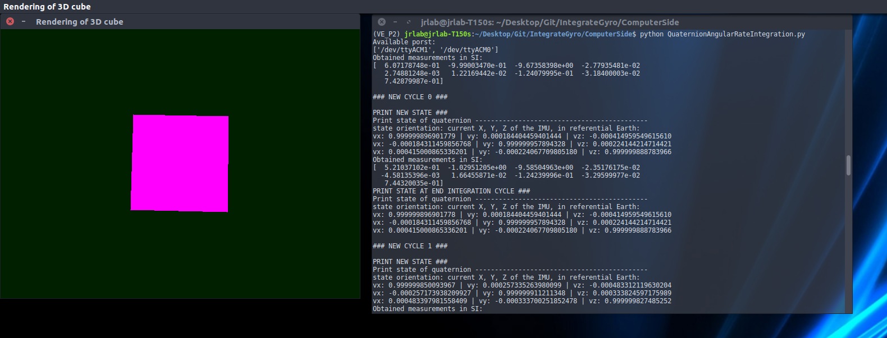

# Integrate gyro data provided by an Arduino over USB, using quaternion-based Python code

The code in this repository integrates the gyroscope output (or rather, angular rate data) generated by, for example, an Adafruit LSM9DS0 board using a quaternion method.

- The **ArduinoSide_LSM9DS0** folder contains the sketch to upload on the Arduino. The sketch configures the LSM9DS0, opens communications with the computer through serial USB, and transmit at regular time intervals the value returned by the IMU board to the computer.

- The **ComputerSide** folder contains all Python code to be run on the computer. The *Quaternions.py* file implements simple quaternion and vector class and operations. The *ReadStructFromArduino.py* file helps reading the C++ struct transmitted by the Arduino. The *PygameRendering.py* file gives access to a class that can display the positioning of the IMU in 3D. Finally, the *QuaternionAngularRateIntergration.py* file performs the integration of the gyro data and calls the relevant functions from all other files.

To execute the code, type in terminal (with the Arduino connected by USB):

```[bash]
python QuaternionAngularRateIntegration.py
```

This will open a window showing the orientation of the IMU, updated in real time:



You can also have a look at the demo video (in the present repo root): video_demo.mp4
# Note

This code only performs integration of the gyro data, i.e. the orientation will drift with time. It does not implement any sort of Kalman filtering or other.
